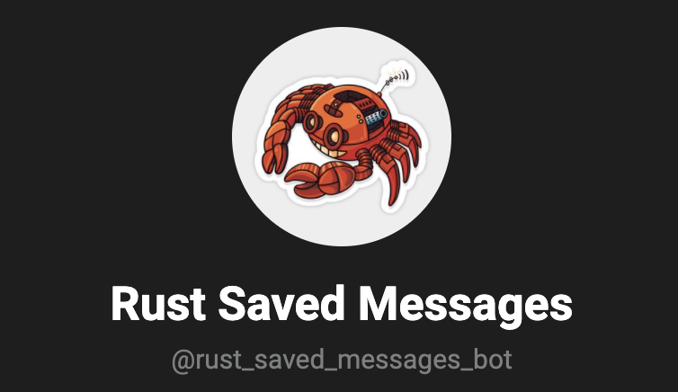
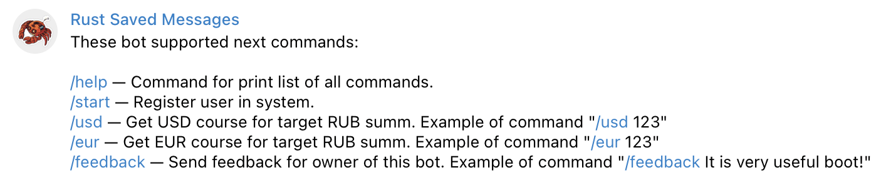
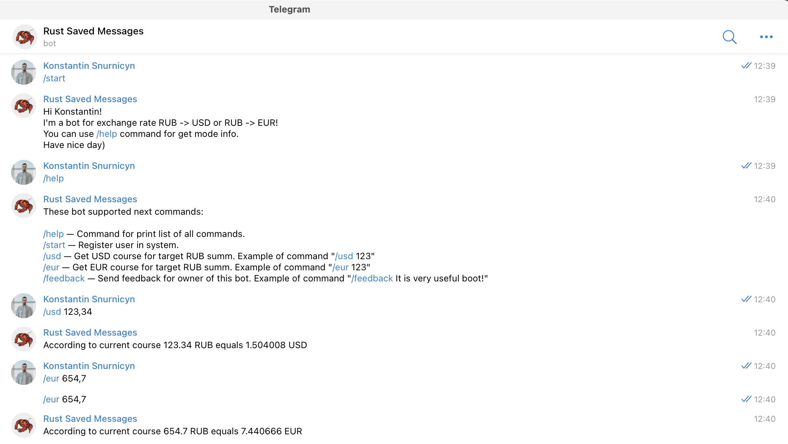

# SAVED MESSAGES BOT

This bot helps to determine current USD and EUR cours related to RUB. Name of bot in Telegram is https://t.me/rust_saved_messages_bot
<hr>

## 🛠 How to run locally
For run locally you need install PostgreSQL DB and Kafka.

Or you can use docker. For it you need run next command: 
```
docker-compose up -d
```

Will be started up: 

- PostgreSQL on 16433 port 
- Kafka cluster on 29092 port 
- Kafka UI on 8080 port

After it you can run application.

## 💡 Application modes

Application has two modes: `Telegram mode` and `REST API mode`. You can run application with only one more per time. For Telegram dode you need use `-- telegram_mode` flag.

In **Telegram mode** application will listen messages from Telegram bot. You can use bot for registration, determine courses or send feedback to support.

In **REST API mode** allows you make requests to application for receive data from BD. For now you can receive only data about users.

## 👩‍💻 Telegram bot responsibility



## ⚙️ Configuration

There are two ways for configure application: `.env` and `application.toml` configuration.


Application use `.env` for determine url to DB, Token for score provider and name of configuration file.

`application.toml` configuration file used by application for store properties for Kafka and Http clients.

## 💻 Screenshots

